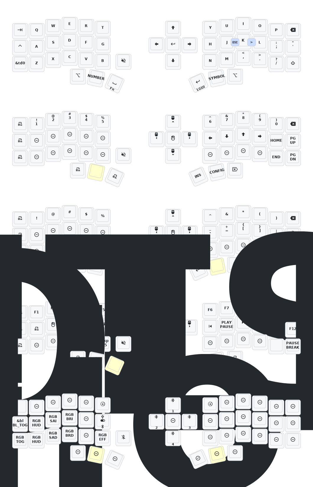

# Eyelash Peripherals Corne ZMK Repository

**This keyboard is not the same as [foostan's Corne](https://github.com/foostan/crkbd). It will not work with standard `corne` firmware.**


## Local build

Init container

```bash
git clone https://github.com/zmkfirmware/zmk.git
docker volume create --driver local -o o=bind -o type=none -o device="/absolute/path/to/zmk-cornish" zmk-config
devcontainer up --workspace-folder "/absolute/path/to/zmk"
docker exec -w /workspaces/zmk -it <container_id> /bin/bash
```
Inside the container 

```bash
cd /workspaces/zmk-config
west init -l config
west update
make build
```
Firmware will be at `build/eyelash_corne_<left|right>.uf2`.

## Keymap Diagram



